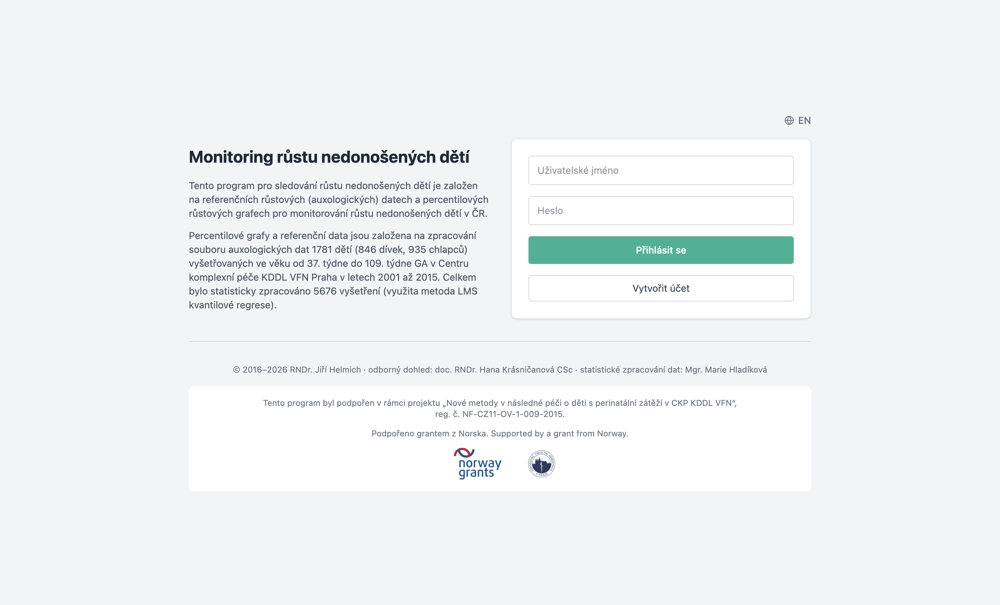
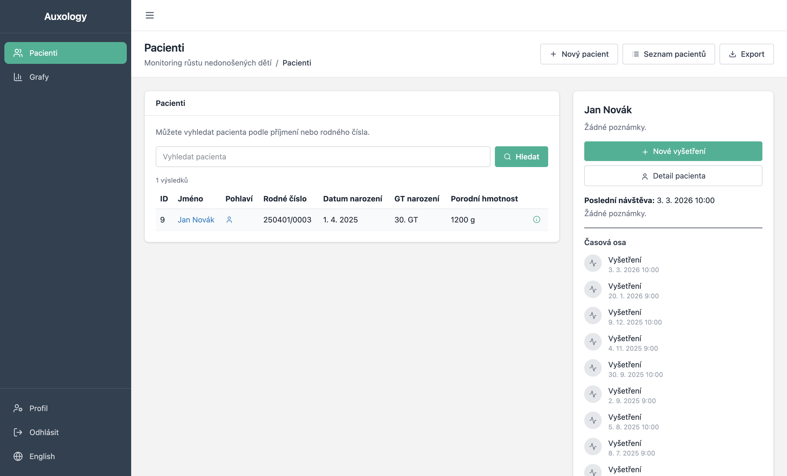
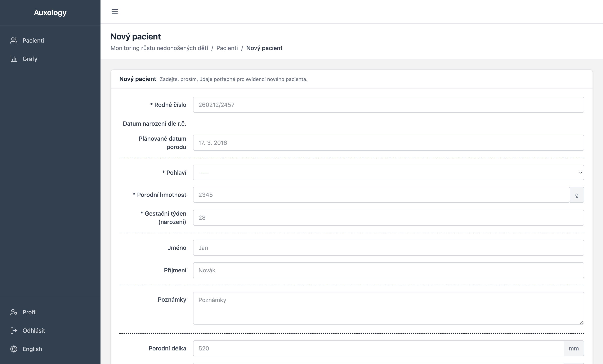
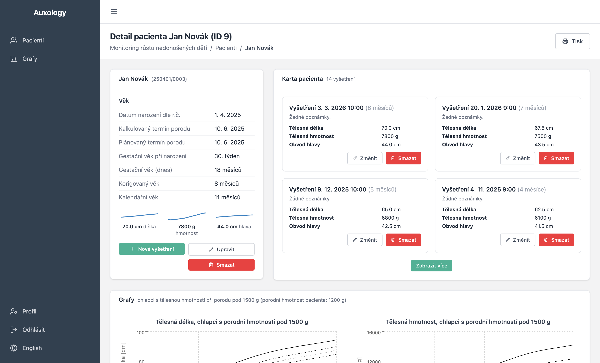
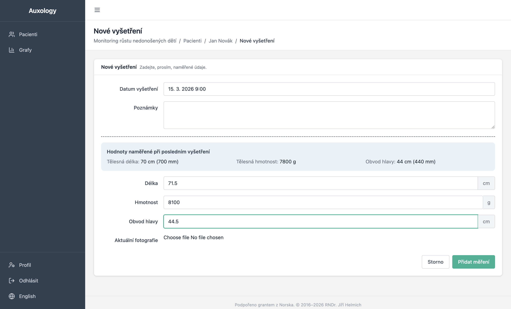
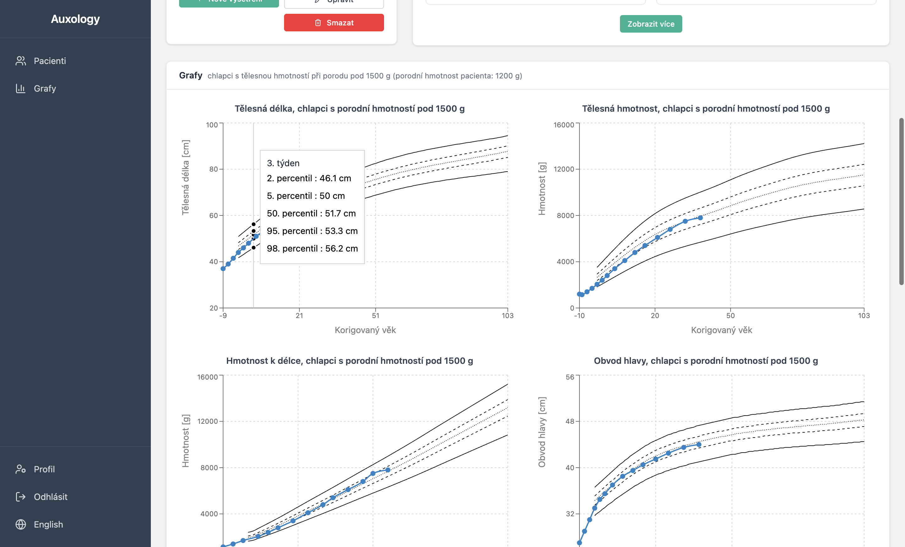
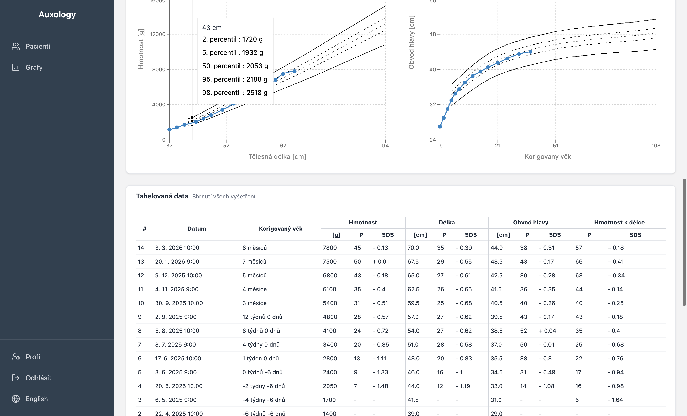
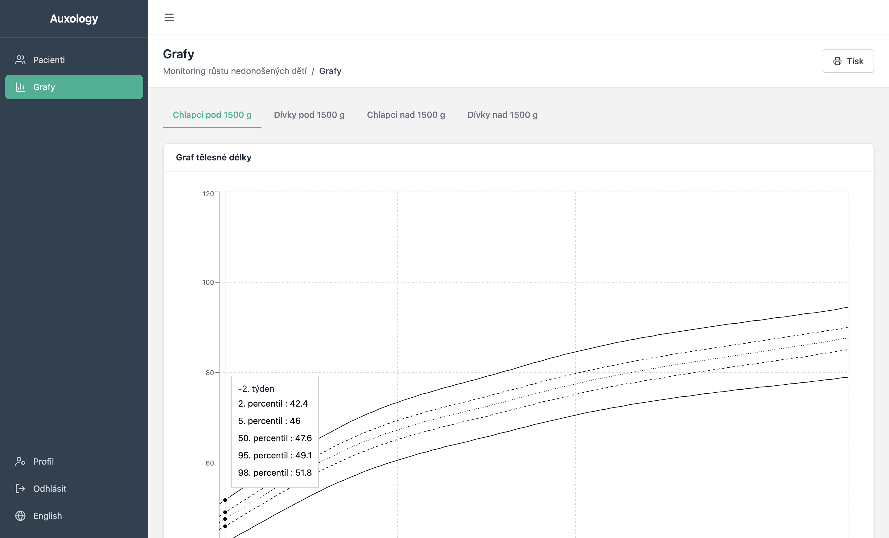
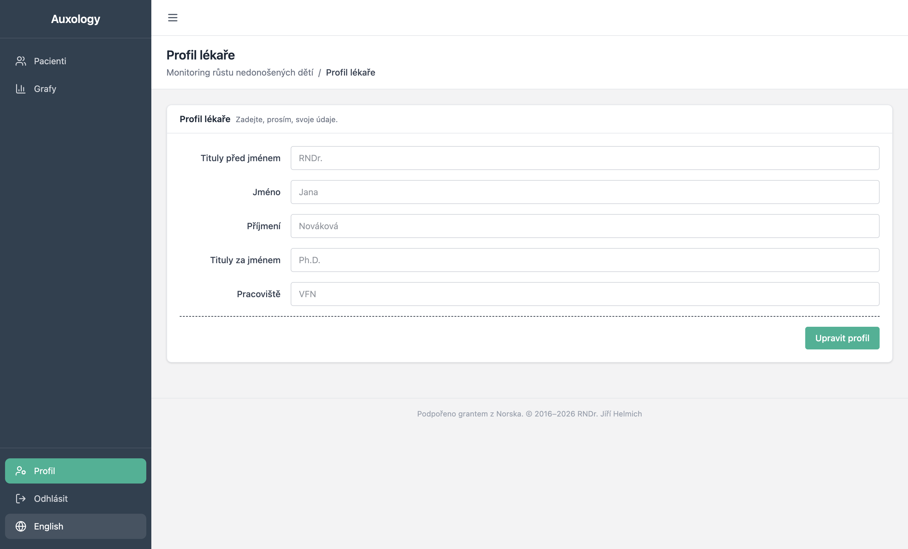

# Auxologie — Uživatelská příručka

Auxologie je desktopová aplikace určená pro neonatology a pediatrické lékaře, kteří potřebují sledovat růst předčasně narozených dětí. Aplikace je postavena na českých referenčních auxologických datech — percentilových růstových grafech odvozených ze studie 1 781 nedonošených dětí (5 676 vyšetření) v Centru komplexní péče, KDDL VFN Praha, v období 2001–2015.

Všechna data jsou uložena lokálně ve vašem počítači. Aplikace neobsahuje žádnou cloudovou komponentu — funguje zcela offline. Běží na macOS i Windows.

Rozhraní je dostupné v **češtině** a **angličtině**. Mezi jazyky lze přepínat kdykoli a vaše preference se zapamatuje.

**Stáhnout:** [macOS (DMG)](https://github.com/jirihelmich/auxology/releases/download/v3.2.0/Auxology-3.2.0-arm64.dmg) · [Windows (EXE)](https://github.com/jirihelmich/auxology/releases/download/v3.2.0/Auxology-Setup-3.2.0.exe) · [Všechny verze](https://github.com/jirihelmich/auxology/releases/latest)

---

## Začínáme

### Vytvoření účtu

Při prvním spuštění aplikace se zobrazí přihlašovací obrazovka. Protože aplikace ukládá data lokálně, váš účet existuje pouze na vašem počítači — není sdílen s nikým.

Klikněte na **Vytvořit účet** pro nastavení uživatelského jména a hesla. Po registraci budete přesměrováni zpět na přihlašovací obrazovku.

Pro přepnutí jazyka rozhraní před přihlášením použijte přepínač **EN/CZ** v pravém horním rohu přihlašovací stránky. Uvnitř aplikace je stejný přepínač dostupný v dolní části postranního menu.

### Přehled pacientů

Po přihlášení se zobrazí přehled pacientů. Toto je centrální obrazovka aplikace — odsud můžete vyhledávat existující pacienty, vytvářet nové, exportovat data nebo přejít k referenčním grafům a profilu přes postranní menu.

Vyhledávací pole přijímá příjmení pacientů a rodná čísla. Výsledky se zobrazí v tabulce s ID, jménem, pohlavím, rodným číslem, datem narození, gestačním stářím při narození a porodní hmotností. Kliknutím na jméno pacienta přejdete na jeho detail. Kliknutím na ikonu info se otevře panel náhledu s časovou osou vyšetření.

---

## Práce s pacienty

### Registrace nového pacienta

Klikněte na **Nový pacient** pro otevření registračního formuláře. Čtyři pole jsou povinná:

1. **Rodné číslo** — české národní identifikační číslo. Aplikace automaticky vypočítá datum narození a ověří kontrolní součet. U žen je měsíc kódován s +50 dle českého standardu.
2. **Pohlaví** — Dívka nebo Chlapec.
3. **Porodní hmotnost** — v gramech. Maximum je 2500 g (práh nedonošenosti).
4. **Gestační týden při narození** — týden gestace, kdy se dítě narodilo (maximum 37).

Volitelně můžete zadat jméno dítěte, plánovaný termín porodu, porodní délku, obvod hlavy při narození a poznámky. Formulář obsahuje také oddíly pro údaje o matce a otci.

### Detail pacienta

Detail pacienta je hlavní pracovní prostor pro jednotlivé dítě. Levý sloupec zobrazuje souhrnnou kartu s informacemi o věku — datum narození (odvozené z rodného čísla), vypočtený a plánovaný termín porodu, gestační stáří při narození, aktuální gestační stáří, korigovaný věk a kalendářní věk. Korigovaný věk je automaticky vypočten odečtením (40 − týden narození) týdnů od skutečného věku.

Pod tabulkou věku jsou sparkline grafy ukazující trend délky, hmotnosti a obvodu hlavy. Akční tlačítka umožňují přidat nové vyšetření, upravit pacienta nebo smazat pacienta a všechna přidružená data.

Pravý sloupec zobrazuje karty vyšetření — každá karta ukazuje datum, korigovaný věk, délku těla, hmotnost, obvod hlavy a poznámky.

---

## Sledování růstu v čase

Hlavním účelem aplikace Auxologie je sledovat, jak předčasně narozené dítě roste ve srovnání s referenčními daty. To se provádí zaznamenáváním vyšetření při každé klinické návštěvě a prohlížením výsledných grafů a statistik.

### Záznam vyšetření

Na stránce detailu pacienta klikněte na **Nové vyšetření**. Formulář požaduje datum a čas vyšetření, délku těla v centimetrech, hmotnost v gramech, obvod hlavy v centimetrech, volitelné poznámky a volitelnou fotografii dítěte.

Pokud existuje předchozí vyšetření, jeho hodnoty se zobrazí nad vstupními poli pro rychlou referenci.

### Růstové grafy

Po zaznamenání alespoň jednoho vyšetření se na stránce detailu pacienta zobrazí čtyři růstové grafy, které vykreslují měření dítěte proti referenčním percentilovým křivkám. Zobrazené percentilové linie jsou 2., 5., 50., 95. a 98. — vypočtené pomocí metody kvantilové regrese LMS.

Čtyři grafy jsou:

- **Délka těla** vs. korigovaný věk
- **Hmotnost** vs. korigovaný věk
- **Obvod hlavy** vs. korigovaný věk
- **Hmotnost k délce** (hmotnost vynesená proti délce těla místo věku)

Referenční křivky jsou vybrány automaticky na základě pohlaví dítěte a zda jeho porodní hmotnost byla nad nebo pod 1500 g. Datové body dítěte jsou spojeny barevnou linií (modrá pro chlapce, červená pro dívky).

### Tabulková data

Pod grafy je souhrnná tabulka se všemi vyšetřeními v chronologickém pořadí. Pro každou návštěvu tabulka ukazuje datum, korigovaný věk a pro každé ze tří měření (hmotnost, délka, obvod hlavy) jak naměřenou hodnotu, tak vypočtený **percentil** a **SDS/Z-skóre**. Samostatný sloupec ukazuje percentil a Z-skóre hmotnosti k délce.

Z-skóre 0 odpovídá 50. percentilu. Hodnoty pod −2 nebo nad +2 indikují měření mimo normální rozsah a mohou vyžadovat klinickou pozornost.

---

## Referenční grafy

Sekce **Grafy**, přístupná z postranního menu, zobrazuje referenční percentilové křivky bez překrytí daty pacienta. To je užitečné pro tisk prázdných grafů, pro vzdělávací účely nebo pro porovnání s měřeními provedenými mimo aplikaci.

Čtyři záložky umožňují přepínat mezi referenčními populacemi:

- Chlapci s porodní hmotností pod 1500 g
- Dívky s porodní hmotností pod 1500 g
- Chlapci s porodní hmotností nad 1500 g
- Dívky s porodní hmotností nad 1500 g

---

## Profil lékaře

Sekce **Profil** umožňuje zadat vaše profesní údaje: titul před jménem (např. RNDr., MUDr.), jméno, příjmení, titul za jménem (např. Ph.D.) a pracoviště. Tyto informace se zobrazují v postranním menu.

---

## Další informace

### Data a soukromí

Všechna data pacientů jsou uložena v lokální databázi IndexedDB ve vaší instanci prohlížeče/Electronu. Nic se nepřenáší po síti. Pokud potřebujete přenést data na jiný počítač, použijte funkci **Export** na přehledu pacientů.

### Automatické odhlášení

Z bezpečnostních důvodů vás aplikace automaticky odhlásí po **2 minutách** nečinnosti.

### Statistické pozadí

Referenční data jsou založena na longitudinální studii nedonošených dětí v České republice:

| | |
|---|---|
| **Velikost vzorku** | 1 781 dětí (846 dívek, 935 chlapců) |
| **Vyšetření** | 5 676 celkem |
| **Věkový rozsah** | 37. až 109. týden gestačního stáří |
| **Instituce** | Centrum komplexní péče, KDDL VFN Praha |
| **Období** | 2001–2015 |
| **Metoda** | Kvantilová regrese LMS |
| **Percentily** | 2., 5., 50., 95., 98. |
| **Měření** | Délka těla, hmotnost, obvod hlavy, hmotnost k délce |
| **Hmotnostní kategorie** | Pod 1500 g / nad 1500 g při narození |
